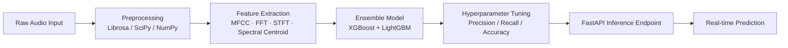

# Audio DeepFake Detection System

**ML pipeline classifying real vs. synthetic audio using signal-processing features and a gradient-boosted ensemble.**

> **Note on this repository:** This is a technical write-up of the system's design, not the original source tree. It documents the pipeline, feature-engineering choices, and modeling approach.

---

## Overview

Detecting synthetic ("deepfake") audio is fundamentally a feature-engineering problem before it's a modeling problem — the raw waveform doesn't tell you much, but the right transforms expose artifacts synthetic audio tends to leave behind.

## My Role

Built the full pipeline solo: feature extraction, model training/tuning, and the inference API.

## Architecture

## Key Design Decisions

- **Feature choice over raw audio.** MFCCs capture the timbral characteristics of a voice; FFT/STFT expose frequency-domain artifacts; spectral centroid tracks the "brightness" of the sound over time. Synthetic audio tends to show subtle inconsistencies across these that a raw-waveform model would need far more data to learn.
- **Ensemble of XGBoost + LightGBM rather than a single model.** The two algorithms make different kinds of errors on tabular feature data, so combining them reduced variance in predictions without needing a deep-learning-scale dataset.
- **FastAPI over Flask for the serving layer.** Async request handling and built-in request/response validation made it a better fit for a real-time inference endpoint than Flask.

## Key Features

- Feature-engineering pipeline (MFCC, FFT, STFT, spectral centroid) built on Librosa/SciPy/NumPy
- Ensemble classifier (XGBoost + LightGBM) with hyperparameter tuning
- Real-time inference exposed via a REST API

## Challenges

Balancing precision vs. recall mattered more than raw accuracy here — a false negative (letting synthetic audio through) and a false positive (flagging real audio) have very different costs. Tuning was done explicitly against precision/recall rather than optimizing for accuracy alone.

## Outcome

A working classification pipeline with a deployable REST endpoint, demonstrating an end-to-end approach from raw audio to real-time fraud-style detection.
