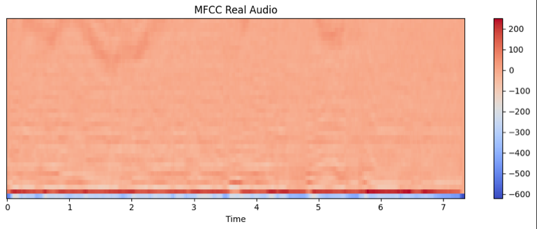
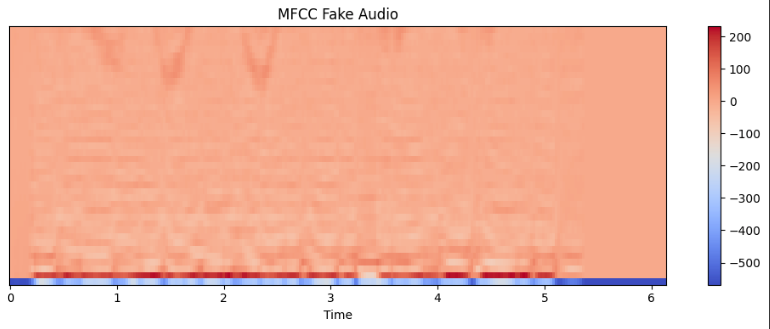
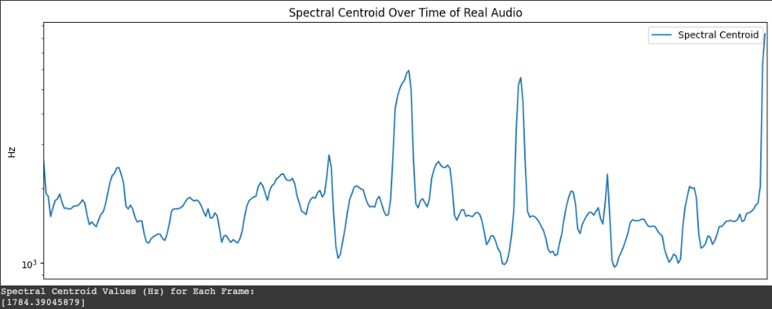
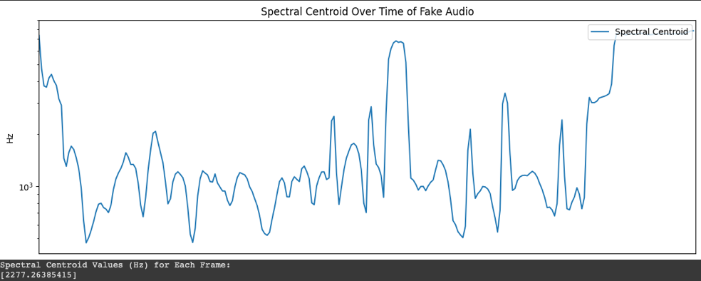
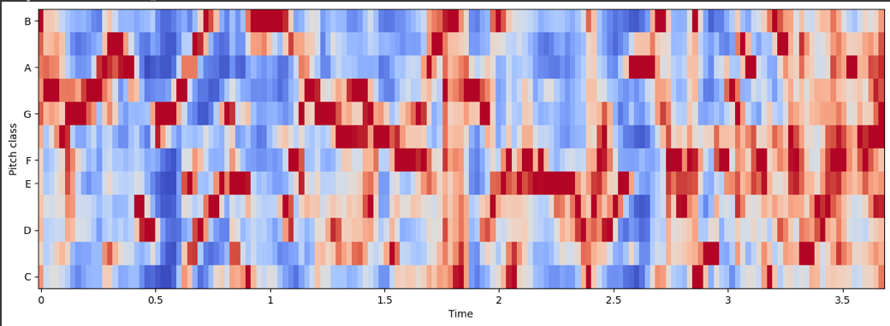
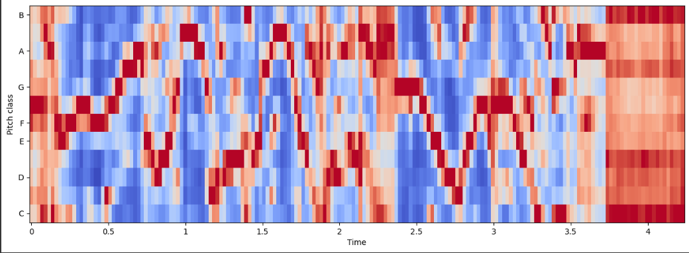

# Feature Engineering — Audio DeepFake Detection

This document covers the 8 feature types extracted from each audio clip, why each is useful for distinguishing real from synthetic speech, and the extraction code.

---

## Why These Features?

Synthetic speech generated by TTS systems (WaveNet, DeepVoice 3, Amazon Polly) is convincing to the human ear, but it leaves statistical fingerprints in the frequency domain. Real speech has natural micro-variations in pitch, energy, and spectral shape that current TTS systems don't perfectly replicate. The features below capture exactly those variations.

Each audio clip produces a **121-dimensional feature vector**:

| Feature | Dimensions | What it captures |
|---------|-----------|------------------|
| MFCC (mean + std) | 80 | Spectral envelope — the "shape" of how energy is distributed across frequencies |
| Spectral Centroid (mean + std) | 2 | Perceived brightness — where the "center of mass" of the spectrum sits |
| Spectral Bandwidth (mean + std) | 2 | How spread out the spectrum is around the centroid |
| Spectral Rolloff (mean + std) | 2 | Frequency below which 85% of spectral energy sits |
| Zero Crossing Rate (mean + std) | 2 | How often the signal crosses zero — correlates with noisiness/percussiveness |
| Chroma (mean + std) | 24 | Energy distribution across 12 musical pitch classes |
| RMS Energy (mean + std) | 2 | Overall loudness and its variation over time |
| Spectral Contrast (mean) | 7 | Difference between peaks and valleys in the spectrum across 7 frequency bands |
| **Total** | **121** | |

## Extraction Code

```python
import librosa
import numpy as np

def extract_features(file_path, sr=22050, duration=5):
    """
    Extracted audio features from a single file.
    Returned a flat numpy array of 121 concatenated features.
    """
    # Load and fix length (pad or trim to consistent duration)
    x, sr = librosa.load(file_path, sr=sr, duration=duration)
    target_length = sr * duration
    if len(x) < target_length:
        x = np.pad(x, (0, target_length - len(x)))
    else:
        x = x[:target_length]

    features = []

    # 1. MFCCs — 40 coefficients, mean + std across time → 80 dims
    mfccs = librosa.feature.mfcc(y=x, sr=sr, n_mfcc=40)
    features.append(mfccs.mean(axis=1))
    features.append(mfccs.std(axis=1))

    # 2. Spectral Centroid — mean + std → 2 dims
    centroid = librosa.feature.spectral_centroid(y=x, sr=sr)
    features.append([centroid.mean(), centroid.std()])

    # 3. Spectral Bandwidth — mean + std → 2 dims
    bandwidth = librosa.feature.spectral_bandwidth(y=x, sr=sr)
    features.append([bandwidth.mean(), bandwidth.std()])

    # 4. Spectral Rolloff — mean + std → 2 dims
    rolloff = librosa.feature.spectral_rolloff(y=x, sr=sr)
    features.append([rolloff.mean(), rolloff.std()])

    # 5. Zero Crossing Rate — mean + std → 2 dims
    zcr = librosa.feature.zero_crossing_rate(x)
    features.append([zcr.mean(), zcr.std()])

    # 6. Chroma — 12 bins, mean + std → 24 dims
    chroma = librosa.feature.chroma_stft(y=x, sr=sr)
    features.append(chroma.mean(axis=1))
    features.append(chroma.std(axis=1))

    # 7. RMS Energy — mean + std → 2 dims
    rms = librosa.feature.rms(y=x)
    features.append([rms.mean(), rms.std()])

    # 8. Spectral Contrast — 7 bands, mean → 7 dims
    contrast = librosa.feature.spectral_contrast(y=x, sr=sr)
    features.append(contrast.mean(axis=1))

    return np.concatenate([np.array(f).flatten() for f in features])
```

## Feature-by-Feature Breakdown

### MFCCs (80 dimensions — the heaviest hitter)

Mel-Frequency Cepstral Coefficients approximate how the human ear perceives sound. 40 coefficients are extracted per time frame, then aggregated to mean + std across all frames.

**Why it works for deepfake detection:** MFCCs capture the spectral envelope of speech. TTS systems replicate the *average* spectral shape well, but their frame-to-frame variation (the `std` component) tends to be smoother and more uniform than real speech. Real humans have micro-hesitations, breath noise, and articulatory inconsistencies that show up as higher MFCC variance.

| Real | Fake |
|------|------|
|  |  |

Notice the real MFCC has more irregular texture across time — the fake one has smoother, more uniform banding.

### Spectral Centroid (2 dimensions)

The "center of mass" of the spectrum — a high centroid means the sound is bright (more high-frequency energy); a low centroid means it's dark.

**Why it works:** TTS audio tends to have a more stable spectral centroid over time (the `std` is lower), because synthesis models optimize for consistency. Real speech has natural brightness fluctuations from consonant-vowel transitions, breath, and room acoustics.

| Real | Fake |
|------|------|
|  |  |

### Chroma (24 dimensions)

Maps all spectral energy into 12 pitch classes (C, C#, D, ..., B), regardless of octave. Mean + std gives 24 dimensions.

**Why it works:** Real speech has richer harmonic overtones that distribute energy across pitch classes in complex, speaker-dependent patterns. TTS systems, particularly older ones, produce more uniform chroma distributions.

| Real | Fake |
|------|------|
|  |  |

### Spectral Contrast (7 dimensions)

Measures the decibel difference between spectral peaks and valleys in 7 frequency sub-bands.

**Why it works:** Real speech recorded through real microphones and rooms has natural spectral peaks and valleys from room resonances and vocal tract geometry. Synthetic speech, generated mathematically, tends to have smoother spectral contrast.

### RMS Energy, Bandwidth, Rolloff, Zero Crossing Rate (8 dimensions)

These are simpler global descriptors — overall loudness, spectral spread, frequency cutoff, and signal noisiness. Individually they're weak classifiers, but combined with the above they fill gaps and push ensemble accuracy up.

## Why Mean + Std Instead of Raw Frames?

A 2-second clip at 22,050 Hz with a hop length of 512 produces ~87 time frames. Feeding all 87 frames per feature would create a variable-length input (different clips have slightly different frame counts after padding) and a much larger feature space (87 × 40 = 3,480 for MFCCs alone).

Taking mean + std compresses each feature to two stable numbers while preserving:
- **Mean:** what the feature typically looks like for this clip
- **Std:** how much it varies over time — and this is where real vs. fake diverges most

The trade-off is losing temporal ordering (the model doesn't know *when* in the clip a feature spiked). For this classification task, the statistical summary is sufficient — 99.82% accuracy confirms that.

---

← Back to [README](../README.md) · Next: [Model Training →](model-training.md)
